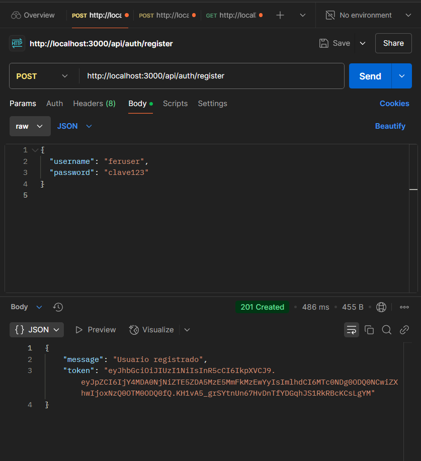
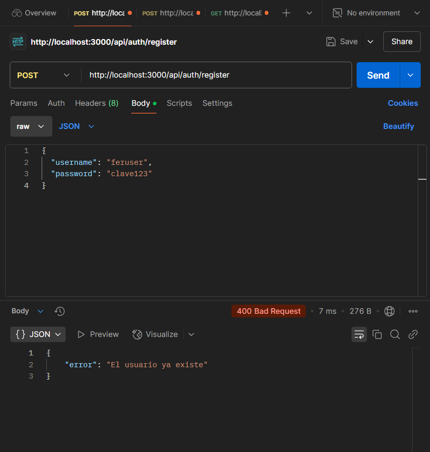
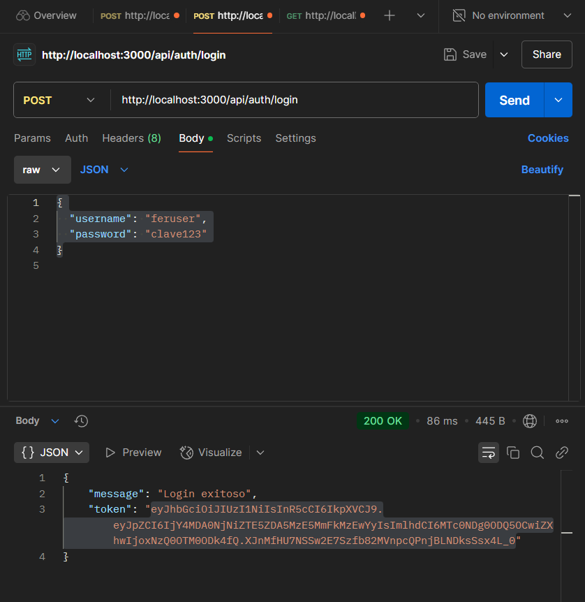
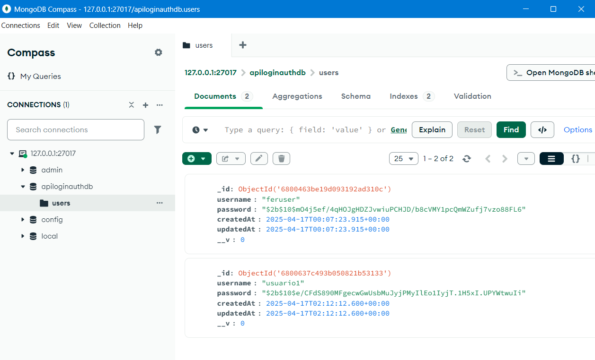

# ApiLoginAuth

API REST para registro, inicio de sesión y autenticación con JWT usando Node.js, Express y MongoDB.

## 🛠 Tecnologías usadas

- Node.js
- Express.js
- MongoDB con Mongoose
- JWT (jsonwebtoken)
- bcryptjs
- dotenv

## 🚀 Endpoints principales

| Método | Ruta        | Descripción                      |
|--------|-------------|----------------------------------|
| POST   | /register   | Registra un nuevo usuario        |
| POST   | /login      | Inicia sesión y retorna un token |

## 🔐 Seguridad

- Las contraseñas se encriptan automáticamente usando bcrypt antes de guardarse.
- La API valida que el usuario no exista antes de registrarlo.
- Se genera y retorna un token JWT válido al registrar o iniciar sesión correctamente.

## ✅ Validaciones realizadas

✔ Registro exitoso 

Resultado: El usuario se registra correctamente y se devuelve un token JWT.

✔ Registro fallido por usuario ya existente 

Resultado: Si el usuario ya existe, la API devuelve un error.

✔ Inicio de sesión exitoso  

Resultado: El usuario inicia sesión y recibe un token JWT válido.

✔ Contraseña encriptada correctamente en la base de datos 

Resultado: La contraseña del usuario se almacena cifrada con bcrypt.

## 🔗 Repositorio

[https://github.com/Defer1189/ApiLoginAuth](https://github.com/Defer1189/ApiLoginAuth)
